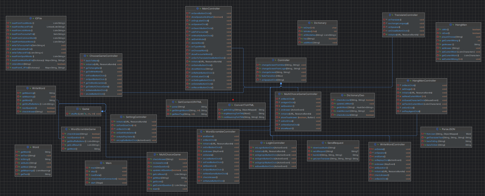

# ỨNG DỤNG TỪ ĐIỂN HỖ TRỢ HỌC TIẾNG ANH
---

## Introduction
* Bài tập lớn môn Lập trinh hướng đối tượng lớp INT2204_1 UET (2023).
* Ứng dụng Dictionary hỗ trợ dịch Tiếng Anh sang Tiếng Việt và hỗ trợ học từ vựng Tiếng Anh.
* Ứng dụng được viết bằng ngôn ngữ Java, sử dụng thư viện JavaFx và thiết kế dựa trên mô hình MVC.
* Ứng dụng sử dụng bộ dữ liệu E_V.txt để nạp dữ liệu.

## Contributors
* [Nguyễn Văn Sớm - 22021194 - K67CB](https://github.com/nvs123456)
* [Nguyễn Văn Thịnh - 22021143 - K67CB](https://github.com/Thinhtrang)
* [Đặng Việt Thành - 22021213 - K67CB](https://github.com/vietthanhf11)

## UML Diagram

## Technologies used
* IntelliJ IDEA Community Edition 2023
* Scene Builder 20
* JDK 20
* JavaFX 20
* CSS
* Maven
* mySQL
  
## Installation

* Cài đặt JDK20
* Clone repo này
    
      git clone https://github.com/sttuet/Dictionary
* Di chuyển vào thư mục mới clone về, mở cmd, gõ lệnh:

      mvn javafx:run

## Features
* Tùy chọn đăng nhập cá nhân hoặc đăng nhập với tư cách khách, đăng xuất tài khoản
* Tra từ, tra nghĩa Anh Việt, Việt Anh
* Dịch câu văn, đoạn văn
* Sử dụng API dịch
* Phát âm tiếng Anh, Tự động phát âm
* Lưu các từ từng tìm kiếm, các từ được đánh dấu
* Thêm, xóa từ, các từ được lưu vào dữ liệu theo từng tài khoản
* Phiên âm chuẩn IPA
* Các game học từ vựng: trắc nghiệm, hangman, sắp xếp từ, word scramble
* Chế độ nền tối, chế độ tự phát âm khi tra từ
* Tăng giảm cỡ chữ

## Demo
* Clip demo: 

## Future improvements
Trong tương lai (có thể) có thêm các tính năng:
* Thêm chức năng phiên dịch từ các ngôn ngữ mới
* Nạp dữ liệu bằng mySQL, SQLite thay vì nạp từ tệp txt
* Cải thiện giao diện người dùng
* Thêm các game, chức năng phức tạp hỗ trợ việc học từ vựng

## Contributing
Mọi ý kiến đóng góp về dự án đều được hoan nghênh

## Project status
Dự án đã được hoàn thành

## Notes
Ứng dụng được viết với mục đích nghiên cứu, học tập
