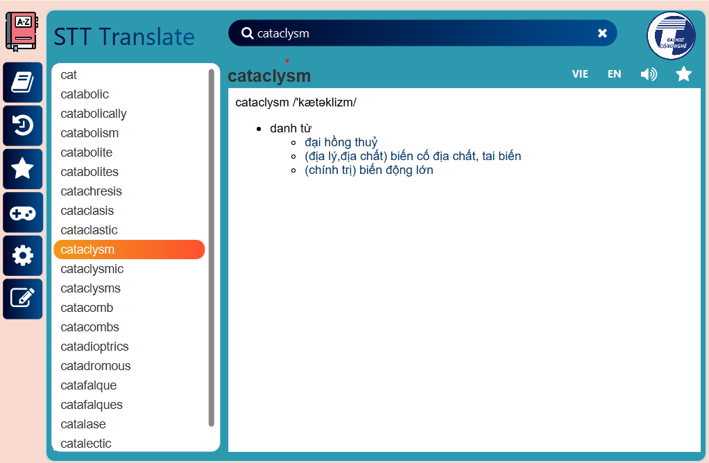

ENGLISH LEARNING APPLICATION
---

## Introduction
* Ứng dụng học tiếng Anh
* Bài tập lớn môn Lập trinh hướng đối tượng lớp INT2204 1 UET (2023)
## Contributors

* [Nguyễn Văn Sớm - 22021194 - K67CB](https://github.com/nvs123456)
* [Nguyễn Văn Thịnh - 22021143 - K67CB](https://github.com/Thinhtrang)
* [Đặng Việt Thành - 22021213 - K67CB](https://github.com/vietthanhf11)
  ##Preview

* Clip demo:[Click vào đây]()

  
  
## Installation

* Cài đặt JDK20
* Clone repo này
    
      git clone https://github.com/sttuet/Dictionary
* Di chuyển vào thư mục mới clone về, mở cmd, gõ lệnh:

      mvn javafx:run

## Features

* Tùy chọn đăng nhập cá nhân hoặc đăng nhập với tư cách khách
* Tra từ, tra nghĩa Anh Việt, Việt Anh
* Dịch câu văn, đoạn văn
* Sử dụng API dịch
* Phát âm tiếng Anh, Tự động phát âm
* Thêm, xóa từ, các từ được lưu vào dữ liệu theo từng tài khoản
* Phiên âm chuẩn IPA
* Các game học từ vựng: trắc nghiệm, hangman, sắp xếp từ
* Dark mode
* Tăng giảm cỡ chữ

## Technologies used
* IntelliJ IDEA Community Edition 2023
* Scene Builder 20
* JDK 20
* JavaFX 20
* CSS
* Maven
* mySQL
